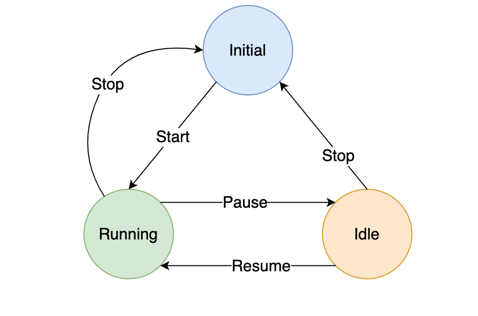

# Finite State Machine

A finite state machine (sometimes called a finite state automaton) is a computation model that can be implemented with hardware or software and can be used to simulate sequential logic and some computer programs. Finite State Machine helps a lot in User Interface flow. xstate is a popular javascript library to create a state machine. It can be used along with modern libraries like React or Vue for maximum effeciency. In this repository I created a simple state machine implementation for stopwatch in Flutter.



```
var stopwatchStateMachine = StateMachine({
  'running': State([
    Transition(action: 'pause', targetState: 'idle'),
    Transition(action: 'stop', targetState: 'initial')
  ]),
  'idle': State([
    Transition(action: 'start', targetState: 'running'),
    Transition(action: 'stop', targetState: 'initial')
  ]),
  'initial': State([
    Transition(action: 'start', targetState: 'running')
  ])
}, 'initial');
```

Detailed information available here.
